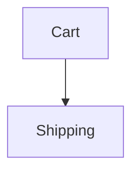

# Verified documentation

Documents in this project are ordinary Markdown — prose and diagrams, readable
on GitHub with no tooling. A few claims inside them are executable, and a few
sections carry a review stamp saying a human has read them against the code.

Your job is to keep those documents **true**, not to make them green.

## The rule that matters most

**When a check fails, the document is not automatically the thing that is
wrong.**

A failure means the document and the code disagree. Before touching either,
work out which one is lying:

- The document states the intended behaviour and the code drifted → **fix the
  code**.
- The behaviour changed deliberately and the document was not updated → **fix
  the document**.
- You cannot tell → **ask**. Say what the document claims, what the code does,
  and that you do not know which was intended.

Editing the document to match the code is the fast way to a green build and it
destroys the entire value of the exercise. A specification that is rewritten to
agree with whatever the code currently does is just a slow, lossy copy of the
code.

## Never stamp without reading

`--stamp` records that a human or agent has **read a section against the code
it covers**. It is the one thing in this system that is pure assertion — there
is nothing behind it but your word.

So:

- Read the covered symbols. Read the prose. Then decide.
- If the prose is now wrong, fix the prose first, then stamp.
- Never run `--stamp` across the repository to clear failures.
- Never stamp a section you have not actually read in this session.

A batch stamp turns every review in the project into a lie, permanently, and
nobody downstream can tell which ones were real.

## Commands

```bash
bun run check.ts docs/thing.md              # check one document
bun run check.ts docs/*.md                  # check all
bun run check.ts docs/thing.md --json       # machine-readable, for triage
bun run check.ts docs/thing.md --write      # fold results back in (never stamps)
bun run check.ts docs/thing.md --stamp      # record reviews as read
bun run check.ts docs/*.md --covering src/x.ts   # which docs describe this file?
```

Exit code is 0 only when every anchor passed, every reference resolved, and
every review is current.

## After changing code

Run `--covering` on the files you touched:

```bash
bun run check.ts docs/*.md --covering src/parser.ts
```

Anything it lists describes code you just changed. Re-read those sections,
correct them if they are now wrong, then stamp. If nothing is listed and you
changed something a reader would want to know about, consider whether a
document should cover it.

## Writing a new document

1. **Write the prose first.** Explain what it does, why it works that way, and
   what you rejected. Do not think about anchors yet.
2. **Read it back** and find the sentences that would be *quietly* wrong if
   someone changed the code next month.
3. **Anchor only those.** Ask: if this claim silently became false, would
   anyone be hurt?
4. **Put reviews on the rationale** — the parts that cannot be executed but
   would embarrass you if they went stale.
5. Run it, fix what fails, stamp what you have read.

Read [docs/writing.md](../../../docs/writing.md) before writing a document. It
covers what earns an anchor and what does not, in more depth than this page.

The short version:

- **Do verify** closed sets (`covers()` — the highest-value check here), a rule
  with a canonical example, and diagrams you would have drawn anyway.
- **Do not verify** rationale, anything the types already prove, anything where
  the handler would restate the implementation, or a large sample space.
- **Do not add a diagram** you would not sketch on a whiteboard when explaining
  the system to a colleague.
- **Do not pad a table** to satisfy the runner. Four rows that show the rule
  beat forty that walk the input space.
- Most of a page should be unverified prose. If more than about a third of it
  is anchors, you are writing tests in Markdown.

## Syntax

An anchor is a blockquote directly above the asset it binds to:

````markdown
> 🛠️ **Verified Data:** `orderTotals`
> **Schema:** `[itemsTotal: Currency, tax: Percentage, total: Currency]`

| Items Total | Tax Rate | Total Owed |
| ----------- | -------- | ---------- |
| $10.00      | 10%      | $11.00     |

> 🛠️ **Verified Flow:** `checkoutFlow`


````

A review covers the section it sits in and binds to nothing:

```markdown
> 👁️ **Reviewed:** `settlement`
> **Covers:** `../src/checkout.ts#paymentMethod`
```

Point `Covers:` at **symbols, not whole files**. A file target is invalidated by
every unrelated edit in that file, and a review that cries wolf gets stamped
without being read.

Handlers live in a `.verify.ts` file beside the document, or wherever a
`<!-- verify: ./x.verify.ts -->` hint points. See
[docs/anchor-reference.md](../../../docs/anchor-reference.md) for the full
vocabulary and [README.md](../../../README.md) for the handler API.

## Things that will trip you up

- **Glyphs are written by the tool.** Do not hand-edit 🛠️ / ✅ / ❌ / 👁️, and do
  not hand-write `<!-- ERROR: -->` or `<!-- REVIEW: -->` comments. They are
  regenerated on every run.
- **A stray paragraph between an anchor and its asset breaks the binding.**
  This is deliberate. Keep them adjacent.
- **Anchor ids must be unique per document.** One `each` and one `all` handler
  may share an id; two of the same mode may not.
- **`--write` never stamps.** That separation is the point; do not work around
  it.
