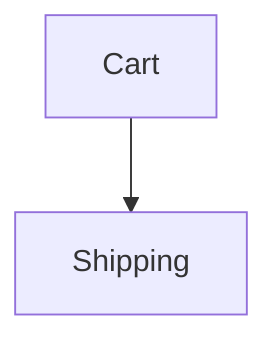

# Verified documentation

Documents in this project are ordinary Markdown — prose and diagrams, readable
on GitHub with no tooling. A few claims inside them are executable, and a few
sections carry a review stamp saying a human has read them against the code.

Your job is to keep those documents **true**, not to make them green.

## The rule that matters most

**When a check fails, the document is not automatically the thing that is
wrong.**

A failure means the document and the code disagree. Before touching either,
work out which one is lying:

- The document states the intended behaviour and the code drifted → **fix the
  code**.
- The behaviour changed deliberately and the document was not updated → **fix
  the document**.
- You cannot tell → **ask**. Say what the document claims, what the code does,
  and that you do not know which was intended.

Editing the document to match the code is the fast way to a green build and it
destroys the entire value of the exercise. A specification that is rewritten to
agree with whatever the code currently does is just a slow, lossy copy of the
code.

## Never stamp without reading

`--stamp` records that a human or agent has **read a section against the code
it covers**. It is the one thing in this system that is pure assertion — there
is nothing behind it but your word.

So:

- Read the covered symbols. Read the prose. Then decide.
- If the prose is now wrong, fix the prose first, then stamp.
- Never run `--stamp` across the repository to clear failures.
- Never stamp a section you have not actually read in this session.

A batch stamp turns every review in the project into a lie, permanently, and
nobody downstream can tell which ones were real.

## Commands

```bash
md-verified docs/thing.md              # check one document
md-verified 'docs/**/*.md'             # check all (globs are expanded by the tool)
md-verified docs/thing.md --json       # machine-readable, for triage
md-verified docs/thing.md --write      # fold results back in (never stamps)
md-verified docs/thing.md --stamp      # record reviews as read
md-verified --covering src/x.ts        # which docs describe this file?
```

Inside the md-verified repository itself, use `bun run check.ts` in place of
`md-verified`.

Under Node, glue cannot use `enum`, `namespace`, parameter properties or
decorators — Node strips types rather than transforming them. If a glue file
fails to load with `not supported in strip-only mode`, either avoid the
construct or prefix the command with
`NODE_OPTIONS=--experimental-transform-types`. Bun has no such limit.

Exit code is 0 only when every anchor passed, every reference resolved, and
every review is current.

## After changing code

Run `--covering` on the files you touched:

```bash
md-verified --covering src/parser.ts
```

Anything it lists describes code you just changed. Re-read those sections,
correct them if they are now wrong, then stamp. If nothing is listed and you
changed something a reader would want to know about, consider whether a
document should cover it.

## Documenting code that already exists

Do **not** sweep a codebase looking for things to document. An agent told to
"document this system" produces forty pages that restate the implementation and
carry no reason for anything — worse than nothing, because they look like
knowledge.

Write a document when you have a reason today:

1. **You are adding a feature** — write it while you understand it.
2. **Something surprised you** — whatever you had to reverse-engineer is what
   the next person will too. This is how old code gets covered without an
   archaeology project.
3. **Something broke on an undocumented assumption** — write the assumption.
4. **You are about to delete or replace something** — capture why it existed.

If none of those apply, do not write a document.

### You are allowed to not know

Documenting code you did not write means hitting things you cannot explain: why
the retry limit is three, why one customer is special-cased, why the obvious
approach was not taken.

**Say so. Do not guess.** A plausible invented rationale is the worst output
you can produce here — it is indistinguishable from a real one, it is confident,
and nobody will ever check it again.

```markdown
## Open questions

- Why is the retry limit 3? Introduced in #412 with no rationale.
```

Then:

- **Never stamp a review over a rationale you guessed.** A stamp says a human
  read the prose against the code and believes it. Guessing and stamping turns
  an open question into a permanent false answer.
- Ask the user about the open questions. They often know, and one answer is
  worth more than the rest of the page.
- Leave the section as prose. Do not try to make it verifiable — that would
  only create pressure to delete the questions.

### Old code resists `Covers:`

Legacy files are large and the interesting logic is often not exported, so you
may have nothing good to point a review at. A whole-file target works but is
invalidated by every unrelated edit, which trains people to stamp blindly.

If there is no exported symbol worth covering, prefer **no review** over a
file-level one that will cry wolf. An unstamped section is honest; a
rubber-stamped one is not.

## Writing a new document

1. **Write the prose first.** Explain what it does, why it works that way, and
   what you rejected. Do not think about anchors yet.
2. **Read it back** and find the sentences that would be *quietly* wrong if
   someone changed the code next month.
3. **Anchor only those.** Ask: if this claim silently became false, would
   anyone be hurt?
4. **Put reviews on the rationale** — the parts that cannot be executed but
   would embarrass you if they went stale.
5. Run it, fix what fails, stamp what you have read.

Read [docs/writing.md](../../../docs/writing.md) before writing a document. It
covers what earns an anchor and what does not, in more depth than this page.

The short version:

- **Do verify** closed sets (`covers()` — the highest-value check here), a rule
  with a canonical example, and diagrams you would have drawn anyway.
- **Do not verify** rationale, anything the types already prove, anything where
  the handler would restate the implementation, or a large sample space.
- **Do not add a diagram** you would not sketch on a whiteboard when explaining
  the system to a colleague.
- **Do not pad a table** to satisfy the runner. Four rows that show the rule
  beat forty that walk the input space.
- Most of a page should be unverified prose. If more than about a third of it
  is anchors, you are writing tests in Markdown.

## Syntax

An anchor is a blockquote directly above the asset it binds to:

````markdown
> 🛠️ **Verified Data:** `orderTotals`
> **Schema:** `[itemsTotal: Currency, tax: Percentage, total: Currency]`

| Items Total | Tax Rate | Total Owed |
| ----------- | -------- | ---------- |
| $10.00      | 10%      | $11.00     |

> 🛠️ **Verified Flow:** `checkoutFlow`


````

A review covers the section it sits in and binds to nothing:

```markdown
> 👁️ **Reviewed:** `settlement`
> **Covers:** `../src/checkout.ts#paymentMethod`
```

Point `Covers:` at **symbols, not whole files**. A file target is invalidated by
every unrelated edit in that file, and a review that cries wolf gets stamped
without being read.

Handlers live in a `.verify.ts` file beside the document, or wherever a
`<!-- verify: ./x.verify.ts -->` hint points. A handler fails by throwing, so
any assertion library works — but prefer the built-ins, because the message
ends up **inside the Markdown file** and terminal-shaped diffs read badly there:

```ts
import { assert, equals, oneOf, covers } from 'md-verified';

equals(calculateTotal(row.items, row.tax), row.total, 'total');
// -> "total: expected 16, got 15"

assert(taxRate < 1, 'tax rates are fractions, not percentages');
// use assert whenever you can say it better yourself
```

See
[docs/anchor-reference.md](../../../docs/anchor-reference.md) for the full
vocabulary and [README.md](../../../README.md) for the handler API.

## Running under `bun test`

Use `loadDocument` rather than importing glue files directly. Anchor ids are
unique per *document*, and Bun shares module state across test files, so two
documents that both use `prices` will collide otherwise.

```ts
import { describe, test, expect } from 'bun:test';
import { loadDocument } from 'md-verified';

for (const file of ['docs/pricing.md', 'docs/limits.md']) {
  const doc = await loadDocument(file);

  describe(doc.file, () => {
    test('references resolve', () => expect(doc.problems).toEqual([]));
    test('reviews current', () =>
      expect(doc.reviews.filter((r) => r.status === 'failed')).toEqual([]));

    for (const suite of doc.suites) {
      describe(suite.id, () => {
        for (const c of suite.cases) test(c.name, () => c.run());
      });
    }
  });
}
```

## Where files go

Documents live beside the code they describe, or in a `docs/` tree — whatever
this project already does. Glue is a `.verify.ts` file next to its document.

**Treat `.verify.ts` exactly like `.test.ts`**: typechecked, never shipped. If
you add the first document to a project, check that

- the glue is inside the `tsconfig.json` `include` (otherwise type errors in
  handlers are silent — Bun strips types and the document still passes), and
- the *build* config excludes `**/*.verify.ts` (otherwise it compiles into the
  production output).

If neither is true, say so rather than silently leaving it broken.

## Things that will trip you up

- **Glyphs are written by the tool.** Do not hand-edit 🛠️ / ✅ / ❌ / 👁️, and do
  not hand-write `<!-- ERROR: -->` or `<!-- REVIEW: -->` comments. They are
  regenerated on every run.
- **A stray paragraph between an anchor and its asset breaks the binding.**
  This is deliberate. Keep them adjacent.
- **Anchor ids must be unique per document.** One `each` and one `all` handler
  may share an id; two of the same mode may not.
- **`--write` never stamps.** That separation is the point; do not work around
  it.
- **Ids are unique per document, not per project.** Two documents may both use
  `prices`; load them with `loadDocument()`.
- **Glue outside `tsconfig` `include` is not typechecked.** The document will
  still pass while the handler has a type error in it.
