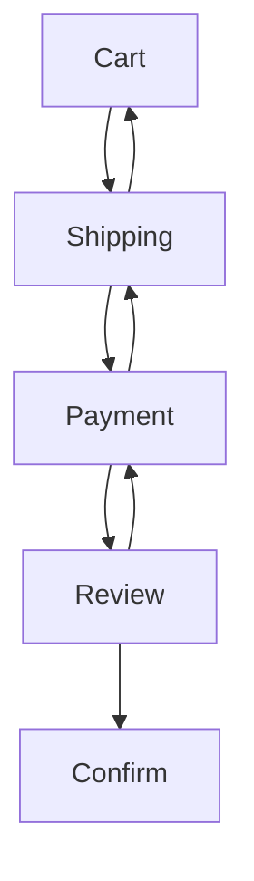

# md-verified

Documentation that is checked against the code it describes.

A document is an ordinary Markdown file. Here is a diagram from one, describing
the steps a customer may move between during checkout:



That renders on GitHub, in VS Code and in any other viewer, because it is an
ordinary Mermaid diagram. It is also executable. The document adds one line
above it, which every renderer shows as a callout:

```markdown
> 🛠️ **Verified Flow:** `checkoutFlow`
```

and a `.verify.ts` file beside the document says what `checkoutFlow` has to be
true of:

```ts
// Every transition drawn in the diagram must be one the code permits.
verify.mermaid.edges("checkoutFlow", async (edge) => {
  assert(
    await checkNavigation(edge.from, edge.to),
    `illegal transition: ${edge.from} -> ${edge.to}`,
  );
});

// And every transition the code permits must be drawn.
verify.mermaid("checkoutFlow", (graph) => {
  covers(
    graph.edges.map((e) => `${e.from} -> ${e.to}`),
    allowedTransitions(),
    {
      noun: "transition",
      missing: (t) => `${t} is allowed by checkNavigation but is not drawn`,
      extra: false, // the per-edge handler above already reports that direction
    },
  );
});
```

Add a transition to `checkNavigation` and forget the diagram, and the run
fails:

```
examples/spec.md
  ✖ checkoutFlow 7/8 (mermaid, line 36)
      whole diagram:36  Review -> Cart is allowed by checkNavigation but is not drawn
```

Draw an edge the code rejects and it fails the other way round. The claim being
checked here is a rule about behaviour — which moves the checkout state machine
permits — rather than a stored value.

Tables and checklists bind the same way, one case per row and per item, with a
whole-asset handler alongside for questions about the set. A table may declare
a `Schema:` line, and its cells then arrive typed: `$10.00` reaches the handler
as `10`, `8.5%` as `0.085`. [`examples/spec.md`](./examples/spec.md) is a
complete document using all three kinds, including this diagram.

Nothing in it is markup that only this tool can read. The blockquote renders as
a callout, the diagram renders as a diagram, and a reader who has never heard
of md-verified sees an ordinary page.

## Why

A pull request shows what changed. It does not show the rule the change was
meant to implement — the reviewer reconstructs that from the diff and from
whatever they already know about the system. That reconstruction is the
expensive part of reviewing, and it is the part that gets skipped.

A short document that states the rule directly is faster to check than the code
that implements it. Adding a payment method should appear as one row in a table
and one edge in a diagram. A reviewer who reads those two changes and agrees
with them has reviewed the intent, and the code below becomes a question of
whether it implements the stated rule rather than whether the rule is right.

The usual objection is that documentation goes out of date, and a reader who
cannot tell which parts are still accurate has to go and read the code anyway.
That is the objection this tool answers. For the claims an anchor covers, an
out-of-date document is a failing build: if the table were wrong, CI would have
said so. This adds very little test coverage — your existing test suite covers
far more, in more detail. What it adds is a document that can be relied on.

That is worth more now than it was a few years ago. When much of the code in a
change was written by an agent, there is more of it per reviewer, and the
reviewer knows less about how any of it came about. A description of the
intended behaviour that is known to be current is short enough to read
carefully. It is also what an agent should be given before it changes anything,
instead of leaving it to infer the intent from the code it is about to
rewrite.

## How it works

1. **Write the document.** Prose first. Where a claim would be damaging if it
   silently became false, put it in a table, a list or a diagram, and put an
   anchor above it — a blockquote naming the asset:

   ```markdown
   > 🛠️ **Verified Flow:** `checkoutFlow`
   ```

2. **Write the glue.** A `checkout.verify.ts` beside `checkout.md` binds each
   id to a function. The function receives the parsed row, edge or list item
   and throws when the code disagrees with it.

3. **Run it in CI.** `md-verified 'docs/**/*.md'` exits non-zero if any claim
   disagrees with the implementation. With `--write`, each failure is recorded
   as an HTML comment directly above the asset that failed, which is where an
   agent sent to fix it needs the message to be.

Two further passes run over the parts of the document that are not anchors:

- **References.** Every link, image path and `#heading` is resolved, and a link
  with a symbol fragment — `[calculateTotal](./checkout.ts#calculateTotal)` —
  fails when that export is renamed or removed.
- **Reviews.** Prose cannot be executed, so a review records which symbols a
  section describes and a digest of them at the moment someone last read the
  two together. When those symbols change, the section is flagged for a human
  to read again.

### What to verify

The goal is documents that stay _true_, which is not the same as documents that
are fully verified — chasing the second costs you the first. Most of a good
document is prose, and prose is what people actually read. See [writing
documents that stay true](./docs/writing.md) for what earns an anchor and what
should stay prose. There is an agent skill at
[`.claude/skills/verified-docs`](./.claude/skills/verified-docs/SKILL.md).

## Install

```
bun add -d md-verified          # or: npm install -D md-verified
bunx md-verified 'docs/**/*.md' # or: npx md-verified 'docs/**/*.md'
```

Runs on **Bun** and **Node 24+**. The package itself uses only `node:`
builtins, so there is one code path rather than a compatibility layer. See
[Runtimes](#runtimes) for the one TypeScript caveat under Node.

Or from a clone:

```
bun install
bun run check.ts examples/spec.md
bun test
```

[`examples/spec.md`](./examples/spec.md) is a specification that passes;
[`examples/broken.md`](./examples/broken.md) is the same document with the code
drifted, for the failure path.

## Anchors

An anchor is a blockquote whose first line matches:

```
> [glyph] **Verified <Label>:** `<id>`
```

The runner then takes the **immediately following block node** and binds it.
The label says what you expect; the node says what is actually there, and a
disagreement is reported rather than guessed at:

`Data` and `Table` bind to a GFM table, `Flow` and `Diagram` to a
` ```mermaid ` block, `Rules` and `Checklist` to a list. The full set of labels
is listed — and verified against the source — in
[docs/anchor-reference.md](./docs/anchor-reference.md).

Lookahead skips only the HTML comments this tool writes itself, so a document
that has already been annotated with failures still binds correctly next run.
Anything else between the anchor and the asset — a stray paragraph — is an
error, not something to search past.

Blockquotes that are not anchors are left alone, so your existing callouts keep
working.

### Schemas

The optional `**Schema:**` line names and types the columns positionally.
Handlers then receive real values instead of strings:

```markdown
> 🛠️ **Verified Data:** `orderTotals`
> **Schema:** `[itemsTotal: Currency, shipping: Currency, tax: Percentage, total: Currency]`
```

`$10.00` arrives as `10`, `8.5%` as `0.085`. Each value is reachable by column
header _and_ by schema field name, with the author's original text preserved on
`row.$raw`:

```ts
row["Items Total"]; // 10
row.itemsTotal; // 10
row.$raw["Items Total"]; // '$10.00'
```

Built-in types cover currency, percentages, numbers, booleans, dates, JSON and
comma-separated lists; the complete table, with a worked example per type, is in
[docs/anchor-reference.md](./docs/anchor-reference.md). A trailing `?`
(`discount?: Currency`) lets a blank cell through as `null`. Register your own
with `verify.type()`.

Without a `Schema:` line, cells arrive as the raw text — which is what you want
when the document's exact formatting is part of the contract.

## Glue code

```ts
import { verify, assert } from "./src/index.ts";

// Once per data row.
verify.table("orderTotals", (row) => {
  const actual = calculateTotal(row.itemsTotal, row.shipping, row.tax);
  assert(actual === row.total, `expected ${row.total}, got ${actual}`);
});

// Once per edge: { from, to, label, style, directed }.
verify.mermaid.edges("checkoutFlow", async (edge) => {
  assert(
    await checkNavigation(edge.from, edge.to),
    `illegal transition: ${edge.from} -> ${edge.to}`,
  );
});

// Once per list item, nested items included.
verify.list("settlementRules", (item) => {
  assert(item.checked === settlesImmediately(item.text), "drifted");
});
```

Return normally to pass, throw to fail. Any assertion library works, including
none.

| Registration                   | Handler receives                   |
| ------------------------------ | ---------------------------------- |
| `verify.table(id, fn)`         | one `TableRow` per data row        |
| `verify.table.all(id, fn)`     | the whole `ParsedTable`            |
| `verify.mermaid(id, fn)`       | the whole `MermaidGraph`           |
| `verify.mermaid.edges(id, fn)` | one `MermaidEdge` per edge         |
| `verify.list(id, fn)`          | one `ListItem` per item            |
| `verify.list.all(id, fn)`      | the whole `ParsedList`             |
| `verify.type(name, fn)`        | — registers a `Schema:` value type |

`MermaidGraph` carries `nodes`, `edges` and `subgraphs`, plus `node(id)`,
`from(id)`, `to(id)`, `hasEdge(a, b)`, `hasPath(a, b)`, `roots()` and
`leaves()`.

One anchor may carry both an `each` and an `all` handler — they answer
different questions about the same asset. Registering the same mode twice is
still an error, so typos are still caught.

Glue is located by, in order: `--glue`, a `<!-- verify: ./x.verify.ts -->` hint
in the document, then `<name>.verify.ts` beside the Markdown file.

### Assertions

A failure message here is not a test log — it is **written into the Markdown
file** and read as documentation. Terminal-shaped output reads badly there:

```
<!-- ERROR: row 1: expect(received).toBe(expected)
     Expected: 15
     Received: 16 -->

<!-- ERROR: row 1: total: expected 15, got 16 -->
```

So the built-ins stay few, and each produces one self-contained line phrased in
terms of the claim:

|                                     |                                                          |
| ----------------------------------- | -------------------------------------------------------- |
| `assert(cond, message)`             | the escape hatch — use it whenever you can say it better |
| `equals(actual, expected, what?)`   | `total: expected 16, got 15`                             |
| `oneOf(value, allowed, what?)`      | `status: "archived" is not one of active, paused`        |
| `covers(documented, actual, opts?)` | see [Completeness](#completeness)                        |

Third-party libraries keep working — a handler fails by throwing and that is
not going away. Multi-line messages keep their structure in the document rather
than being flattened onto one line.

## Completeness

Per-element handlers only ever check elements that exist. If the code grows a
fifth payment method and nobody adds a row, every row still passes and the
document is quietly wrong. `covers()` is the assertion that catches it:

```ts
verify.mermaid("checkoutFlow", (graph) => {
  covers(
    graph.edges.map((e) => `${e.from} -> ${e.to}`),
    allowedTransitions(),
    {
      noun: "transition",
      missing: (t) => `${t} is allowed by checkNavigation but is not drawn`,
      extra: false, // the per-edge handler already owns this direction
    },
  );
});
```

It throws once, listing every gap, so a single run tells you the whole story.
Options: `missing` / `extra` take a message function or `false` to allow that
direction, `duplicates` (default on) flags a key the document lists twice, and
`noun` names the thing in default messages.

This is the check worth reaching for first. A _missing_ element is
machine-identifiable in a way a wrong one is not — the runner knows exactly
which row should exist, which is what makes the annotation actionable.

## Reference checking

Anchors verify the assets. A second pass verifies the prose around them: links
to files that have moved, in-document anchors that no longer resolve, and —
where you ask for it with a fragment — symbols that no longer exist.

```markdown
Computed by [`calculateTotal`](./checkout.ts#calculateTotal).
```

That renders as an ordinary link, and it carries everything needed to check it:

```
examples/broken.md
  ✖ 12:24 broken symbol: ./checkout.ts#calculateTotals (no export named
          `calculateTotals`) (did you mean `calculateTotal`?)
  ✖ 13:19 broken link: ./appendix.md (no such file)
```

Checked automatically: every link and image path, `#heading` anchors within the
document and into other Markdown files, and link definitions. Nothing implicit
is ever checked — bare inline code is not treated as a symbol, because
`$10.00`, `--write` and `[itemsTotal: Currency]` are all inline code in a
perfectly healthy spec. A document opts in by linking.

Only files you fragment-link are imported, and only to read their export names.
`--no-symbols` keeps the link checks but imports nothing; `--no-links` skips the
pass entirely.

## Reviews: the parts that cannot be executed

Most of a good document is prose — rationale, context, the reason a rule exists
at all. That is usually the part worth reading, and nothing fails when it
becomes wrong.

A review does not try to verify prose. It records which code a section
describes, and a digest of that code at the moment someone last read the two
together:

```markdown
> 👁️ **Reviewed:** `settlement`
> **Covers:** `../src/checkout.ts#paymentMethod`
> **Digest:** `1:3aaced165261`
```

When `paymentMethod` changes, the digest stops matching and the section is
flagged for a human to re-read. That is an attestation, not a proof — the
weaker claim, deliberately, because the alternative is either checking nothing
or pretending prose can be executed.

`--stamp` records the digest. It is **separate from `--write` on purpose**: a
stamp applied as a side effect of a normal run would attest to nothing.

Name the review you actually re-read — `--stamp settlement`, repeatable. Bare
`--stamp` stamps every review in the document, which in a document with six of
them files an attestation for five sections nobody opened.

`--stamp` also refuses to run while an anchor is failing: the document and the
code demonstrably disagree at that point, so a reading of the two together
cannot have concluded they match. `--force` overrides it.

The `1:` prefix is the digest format version. It exists so that a future change
to the algorithm can be reported as "re-stamp needed" rather than as "the code
changed", which would be a lie and would train people to stamp blindly.

Digests ignore line endings, so a mixed Windows/Unix team does not see
everything go stale.

Point `Covers:` at a **symbol** rather than a whole file. A file-level target is
invalidated by every unrelated edit in that file, and a review that is flagged
by edits it has nothing to do with gets stamped without being read. Symbol
targets ignore edits elsewhere in the file, and ignore changes to leading
comments.

### Which documents describe this code?

The mapping from prose to code already lives in the documents, so there is no
need for a marker in the source:

```
$ bun run check.ts docs/*.md --covering src/parser.ts
Reviews covering src/parser.ts:
  docs/anchor-reference.md:14  binding  ../src/parser.ts#parseMarkdown
```

Run it on the files a change touched. Anything listed describes code that just
moved.

## Writing results back into the document

`--write` folds the result of a run back into the document. The glyph changes,
and each failure is recorded as an HTML comment directly above the asset that
failed:

```markdown
> ❌ **Verified Flow:** `checkoutFlow` (Failed: 1 of 4)

<!-- ERROR: Cart -> Payment: illegal transition: Cart -> Payment -->

'''mermaid
graph TD
Cart[Cart Page] --> Shipping[Shipping Info]
Cart --> Payment[Payment Info]
'''
```

Comments are invisible in every renderer, so the page still reads as prose. For
an agent, the failure text is placed at exactly the point that has to change,
with no separate log to correlate against the document.

Three properties this relies on, all covered by the test suite:

- **Surgical.** Rewriting splices the original source; it never re-serialises
  the AST. Prose, table alignment and diagram indentation survive byte for byte.
- **Idempotent.** Annotating an annotated document is a no-op. (This is why the
  comments carry case names rather than line numbers — writing the comments
  shifts the lines they would otherwise cite. Exact lines are in `--json`.)
- **Reversible.** A later green run clears the marks; `--reset` returns the file
  to its unrun state exactly.

## CLI

```
md-verified <file.md|glob> [...] [options]

  --glue <path>   Glue module to load
  --write, -w     Fold results back into the file
  --report        Print the annotated Markdown to stdout instead
  --reset         Return anchors to their unrun state
  --json          Machine-readable results, for agents and CI
  --stamp [id]    Record a review as read (repeatable; never implied by
                  --write). With no id, stamps every review in the document
  --force         Allow --stamp on a run with failing anchors
  --import <l>    Re-run under `node --import <l>` (repeatable; Bun ignores it)
  --covering <p>  List the reviews that cover a source file
  --no-links      Skip link, anchor and symbol checking
  --no-symbols    Skip symbol checking
  --no-reviews    Skip review staleness checking
  --only <id>     Run one anchor (repeatable)
  --bail          Stop at the first failure
  --timeout <ms>  Per-case timeout (default 5000, 0 disables)
  --verbose, -v   Show passing cases and stack frames
```

Exit code is 0 only when every anchor passed, every anchor bound to a handler,
every reference resolved, and every review is current. An anchor with no
handler is a failure, not a skip — otherwise a mistyped id would delete the
check and leave the run green.

### How things fail

|                             | Reported as                  | Annotated into the document     |
| --------------------------- | ---------------------------- | ------------------------------- |
| Handler throws              | a failed case                | yes                             |
| A cell will not coerce      | a failed case, that row only | yes                             |
| Schema or diagram malformed | a failed anchor              | yes                             |
| No handler registered       | a failed anchor              | yes                             |
| Broken link or symbol       | a problem, with `line:col`   | no — it is prose, not an anchor |
| Covered code changed        | a stale review               | yes                             |

A row whose cell will not coerce never reaches your handler, and a whole-asset
handler is never run against a table that is silently missing rows.

## Under `bun test`

`loadDocument()` expands a document into cases without running them, so Bun's
test runner can own scheduling and reporting — one native test per table row:

```ts
import { describe, test, expect } from "bun:test";
import { loadDocument } from "md-verified";

for (const file of ["docs/pricing.md", "docs/limits.md"]) {
  const doc = await loadDocument(file);

  describe(doc.file, () => {
    test("references resolve", () => expect(doc.problems).toEqual([]));
    test("reviews current", () =>
      expect(doc.reviews.filter((r) => r.status === "failed")).toEqual([]));

    for (const suite of doc.suites) {
      describe(suite.id, () => {
        for (const c of suite.cases) test(c.name, () => c.run());
      });
    }
  });
}
```

Use `loadDocument` rather than importing glue files directly. Anchor ids are
unique per _document_, and Bun shares module state across test files, so two
documents that both use `prices` would otherwise collide. `loadDocument`
isolates the registry per document; cases keep their own handler afterwards.

`planCases()` is the lower-level primitive if you need it. See
[`spec.test.ts`](./spec.test.ts).

## Runtimes

The tool imports your `.verify.ts` glue at runtime, so what matters is how the
runtime resolves and compiles it. Node has two separate limits; Bun has neither.

|          | Module resolution                     | Glue TypeScript                      |
| -------- | ------------------------------------- | ------------------------------------ |
| Bun      | Extensionless imports resolve.        | Fully transformed. Everything works. |
| Node 24+ | Every relative import needs its file extension. | Type **stripping** only.   |

### Module resolution — the one most projects hit

Node's ESM resolver does not add file extensions. A project configured with
`"moduleResolution": "bundler"` — most TypeScript monorepos — writes
`./classify`, not `./classify.ts`, and Node refuses it:

```
docs/x.md: glue file docs/x.verify.ts failed to load:
  Cannot find module '/.../src/pipeline/classify'
  imported from /.../src/pipeline/orchestrator.ts
```

This applies to the whole import graph, not just the glue file: one
extensionless import anywhere your glue reaches is enough. It has nothing to do
with which TypeScript features you use, so it happens whether or not the type
stripping below affects you.

Either use extensioned specifiers throughout, or pass a loader:

```bash
npx md-verified docs/thing.md --import tsx
```

`--import` re-runs the command under `node --import <loader>`, so the loader is
installed before your glue is resolved. It is repeatable, and ignored under Bun,
which needs no loader. The published bin uses a `node` shebang, so `npx` works
out of the box; to run under Bun instead use `bunx --bun md-verified`.

### Type stripping

Node strips types rather than transforming them, so a few TypeScript features
do not survive **in glue, or in anything glue imports as `.ts`**:

```
enum, namespace, parameter properties (constructor(readonly x: string)), decorators
```

Types, interfaces, generics, `as const`, `satisfies` and type-only exports are
all fine. In practice glue is plain functions, so this rarely matters — the case
that does is glue importing an `enum` from your application code:

```bash
NODE_OPTIONS=--experimental-transform-types npx md-verified docs/thing.md
```

That flag changes how types are compiled. It does **not** affect module
resolution, so it will not fix the error above.

Deno is untested. It should work in principle, via `node:` compatibility and an
`npm:` specifier, but nothing here verifies that.

## Where to put documents and glue

Put documents wherever you like — beside the code they describe, or in a `docs/`
tree. The tool does not care. Your `tsconfig.json` does, and it fails in a
different way for each.

**The rule: treat `.verify.ts` exactly like `.test.ts`.** It is TypeScript that
should be _checked_ but not _shipped_, which is a problem your project has
already solved once.

Concretely, two configs — a wide one for checking and the editor, a narrow one
for building:

```jsonc
// tsconfig.json — what gets typechecked
{ "compilerOptions": { "noEmit": true }, "include": ["src", "docs"] }

// tsconfig.build.json — what gets compiled
{
  "extends": "./tsconfig.json",
  "compilerOptions": { "noEmit": false, "outDir": "dist", "rootDir": "src" },
  "include": ["src"],
  "exclude": ["**/*.verify.ts", "**/*.test.ts"]
}
```

Without that split you hit one of these:

| Layout                                              | What goes wrong                                                                                                              |
| --------------------------------------------------- | ---------------------------------------------------------------------------------------------------------------------------- |
| `docs/` beside `src/`, `"include": ["src"]`         | Glue is **never typechecked**. A real type error in a handler is invisible — Bun strips types, so the document still passes. |
| `docs/` added to `include`, with `"rootDir": "src"` | `TS6059: File 'docs/x.verify.ts' is not under 'rootDir'`.                                                                    |
| Co-located `src/**/*.verify.ts`                     | Typechecked correctly, but the glue **compiles into your production build** (`dist/billing/billing.verify.js`).              |

The first is the dangerous one, because nothing tells you.

Glue can import application code however the rest of your project does —
`tsconfig` path aliases work, since Bun reads them.

## Source files

| File                                                     |                                                              |
| -------------------------------------------------------- | ------------------------------------------------------------ |
| [`src/parser.ts`](./src/parser.ts)                       | Markdown → anchors: the AST walk, lookahead binding, schemas |
| [`src/mermaid.ts`](./src/mermaid.ts)                     | Mermaid flowcharts → nodes and edges                         |
| [`src/framework.ts`](./src/framework.ts)                 | The `verify` registry                                        |
| [`src/runner.ts`](./src/runner.ts)                       | Execution, case planning, glue resolution                    |
| [`src/report.ts`](./src/report.ts)                       | Terminal output and the Markdown rewrite                     |
| [`src/references.ts`](./src/references.ts)               | Link, anchor and symbol checking                             |
| [`src/covers.ts`](./src/covers.ts)                       | Set assertions for completeness                              |
| [`src/assertions.ts`](./src/assertions.ts)               | `assert`, `equals`, `oneOf`                                  |
| [`src/reviews.ts`](./src/reviews.ts)                     | Review staleness and digests                                 |
| [`src/symbols.ts`](./src/symbols.ts)                     | Static symbol lookup, via the TS compiler API                |
| [`src/coerce.ts`](./src/coerce.ts)                       | `Schema:` value types                                        |
| [`check.ts`](./check.ts)                                 | CLI                                                          |
| [`examples/spec.md`](./examples/spec.md)                 | A specification that passes                                  |
| [`examples/broken.md`](./examples/broken.md)             | The same spec, drifted, for the failure path                 |
| [`docs/writing.md`](./docs/writing.md)                   | What earns an anchor, and what does not                      |
| [`docs/anchor-reference.md`](./docs/anchor-reference.md) | The vocabulary, verified against the source                  |

## Prototype limits

- Mermaid support covers the flowchart/graph family. Sequence and class
  diagrams parse only as far as their `A --> B` statements go.
- Glue modules are loaded with a cache-busting query string, so a long-lived
  process re-registering the same file will accumulate module instances.
- Anchor ids must be unique per document. The CLI clears the registry between
  files; in-process, use `loadDocument()`.
- Node's type stripping cannot handle `enum`, `namespace`, parameter properties
  or decorators in glue, and rejects relative imports with no file extension.
  See [Runtimes](#runtimes): `--import <loader>` covers resolution,
  `NODE_OPTIONS=--experimental-transform-types` covers the type features.
- Deno is untested.
- Symbol lookup reads files rather than importing them, so nothing in the
  checked project is executed and type-only exports are visible. The trade-off
  is that `export * from './x'` is not followed.
- A reference with no definition (`[text][missing]`) cannot be flagged:
  CommonMark leaves it as literal text, so there is no node in the tree. The
  reader does see the broken brackets.
