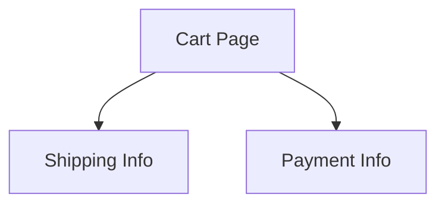

# md-verified

Executable specifications from Markdown that nobody has to learn to read.

There is no Given/When/Then, no feature-file dialect, no custom renderer. A
specification is an ordinary `.md` file with ordinary tables, lists and Mermaid
diagrams. It looks native on GitHub, in VS Code, and in any Markdown viewer you
already use. A blockquote above each asset registers it with the test runner:

```markdown
> 🛠️ **Verified Data:** `orderTotals`
> **Schema:** `[itemsTotal: Currency, shipping: Currency, tax: Percentage, total: Currency]`

| Items Total | Shipping | Tax Rate | Total Owed |
| ----------- | -------- | -------- | ---------- |
| $10.00      | $5.00    | 10%      | $16.00     |
```

The blockquote renders as a callout. The table renders as a table. Nothing in
the document is inert markup that only a tool understands.

```
bun install
bun run check.ts examples/spec.md
bun test
```

## How binding works

An anchor is a blockquote whose first line matches:

```
> [glyph] **Verified <Label>:** `<id>`
```

The runner then takes the **immediately following block node** and binds it.
The label says what you expect; the node says what is actually there, and a
disagreement is reported rather than guessed at:

| Label | Binds to |
| --- | --- |
| `Data`, `Table`, `Rows`, `Examples`, `Cases`, `Dataset`, `Matrix` | a GFM table |
| `Flow`, `Diagram`, `Graph`, `Mermaid`, `Flowchart`, `States` | a ` ```mermaid ` block |
| `Rules`, `List`, `Steps`, `Checklist`, `Items` | a bullet or ordered list |

Lookahead skips only the HTML comments this tool writes itself, so a document
that has already been annotated with failures still binds correctly next run.
Anything else between the anchor and the asset — a stray paragraph — is an
error, not something to search past.

Blockquotes that are not anchors are left alone, so your existing callouts keep
working.

### Schemas

The optional `**Schema:**` line names and types the columns positionally.
Handlers then receive real values instead of strings:

```markdown
> 🛠️ **Verified Data:** `orderTotals`
> **Schema:** `[itemsTotal: Currency, shipping: Currency, tax: Percentage, total: Currency]`
```

`$10.00` arrives as `10`, `8.5%` as `0.085`. Each value is reachable by column
header *and* by schema field name, with the author's original text preserved on
`row.$raw`:

```ts
row['Items Total']  // 10
row.itemsTotal      // 10
row.$raw['Items Total'] // '$10.00'
```

Built-in types: `Currency`, `Percentage`, `Number`, `Integer`, `Boolean`,
`Date`, `String`, `JSON`, `List`. A trailing `?` (`discount?: Currency`) lets a
blank cell through as `null`. Register your own with `verify.type()`.

Without a `Schema:` line, cells arrive as the raw text — which is what you want
when the document's exact formatting is part of the contract.

## Glue code

```ts
import { verify, assert } from './src/index.ts';

// Once per data row.
verify.table('orderTotals', (row) => {
  const actual = calculateTotal(row.itemsTotal, row.shipping, row.tax);
  assert(actual === row.total, `expected ${row.total}, got ${actual}`);
});

// Once per edge: { from, to, label, style, directed }.
verify.mermaid.edges('checkoutFlow', async (edge) => {
  assert(await checkNavigation(edge.from, edge.to),
    `illegal transition: ${edge.from} -> ${edge.to}`);
});

// Once per list item, nested items included.
verify.list('settlementRules', (item) => {
  assert(item.checked === settlesImmediately(item.text), 'drifted');
});
```

Return normally to pass, throw to fail. Any assertion library works, including
none.

| Registration | Handler receives |
| --- | --- |
| `verify.table(id, fn)` | one `TableRow` per data row |
| `verify.table.all(id, fn)` | the whole `ParsedTable` |
| `verify.mermaid(id, fn)` | the whole `MermaidGraph` |
| `verify.mermaid.edges(id, fn)` | one `MermaidEdge` per edge |
| `verify.list(id, fn)` | one `ListItem` per item |
| `verify.list.all(id, fn)` | the whole `ParsedList` |
| `verify.type(name, fn)` | — registers a `Schema:` value type |

`MermaidGraph` carries `nodes`, `edges` and `subgraphs`, plus `node(id)`,
`from(id)`, `to(id)`, `hasEdge(a, b)`, `hasPath(a, b)`, `roots()` and
`leaves()`.

Glue is located by, in order: `--glue`, a `<!-- verify: ./x.verify.ts -->` hint
in the document, then `<name>.verify.ts` beside the Markdown file.

## Bi-directional state

`--write` folds the result of a run back into the document. The glyph changes,
and each failure is recorded as an HTML comment directly above the asset that
failed:

```markdown
> ❌ **Verified Flow:** `checkoutFlow` (Failed: 1 of 4)

<!-- ERROR: Cart -> Payment: illegal transition: Cart -> Payment -->


```

Comments are invisible in every renderer, so the page still reads as prose. For
an agent, the failure text sits at exactly the place that has to change — no
separate log to correlate against the document.

Three properties this relies on, all covered by the test suite:

- **Surgical.** Rewriting splices the original source; it never re-serialises
  the AST. Prose, table alignment and diagram indentation survive byte for byte.
- **Idempotent.** Annotating an annotated document is a no-op. (This is why the
  comments carry case names rather than line numbers — writing the comments
  shifts the lines they would otherwise cite. Exact lines are in `--json`.)
- **Reversible.** A later green run clears the marks; `--reset` returns the file
  to its unrun state exactly.

## CLI

```
bun run check.ts <file.md> [...] [options]

  --glue <path>   Glue module to load
  --write, -w     Fold results back into the file
  --report        Print the annotated Markdown to stdout instead
  --reset         Return anchors to their unrun state
  --json          Machine-readable results, for agents and CI
  --only <id>     Run one anchor (repeatable)
  --bail          Stop at the first failure
  --timeout <ms>  Per-case timeout (default 5000, 0 disables)
  --verbose, -v   Show passing cases and stack frames
```

Exit code is 0 only when every anchor passed and every anchor bound cleanly.

## Under `bun test`

`planCases()` expands a document into cases without running them, so Bun's test
runner can own scheduling and reporting — one native test per table row:

```ts
for (const anchor of parsed.anchors) {
  describe(anchor.id, () => {
    for (const kase of planCases(anchor, file).cases) {
      test(kase.name, () => kase.run());
    }
  });
}
```

See [`spec.test.ts`](./spec.test.ts).

## Layout

| File | |
| --- | --- |
| [`src/parser.ts`](./src/parser.ts) | Markdown → anchors: the AST walk, lookahead binding, schemas |
| [`src/mermaid.ts`](./src/mermaid.ts) | Mermaid flowcharts → nodes and edges |
| [`src/framework.ts`](./src/framework.ts) | The `verify` registry |
| [`src/runner.ts`](./src/runner.ts) | Execution, case planning, glue resolution |
| [`src/report.ts`](./src/report.ts) | Terminal output and the Markdown rewrite |
| [`src/coerce.ts`](./src/coerce.ts) | `Schema:` value types |
| [`check.ts`](./check.ts) | CLI |
| [`examples/spec.md`](./examples/spec.md) | A specification that passes |
| [`examples/broken.md`](./examples/broken.md) | The same spec, drifted, for the failure path |

## Prototype limits

- Mermaid support covers the flowchart/graph family. Sequence and class
  diagrams parse only as far as their `A --> B` statements go.
- Glue modules are loaded with a cache-busting query string, so a long-lived
  process re-registering the same file will accumulate module instances.
- Anchor ids must be unique per file; the CLI clears the registry between files.
