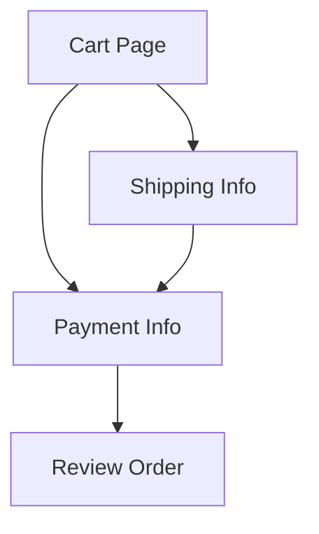

# Checkout (drifted)

<!-- verify: ./spec.verify.ts -->

The same specification as [`spec.md`](./spec.md), but the document has drifted
away from the implementation. It runs against exactly the same glue code, so
every failure below is a real disagreement between prose and behaviour.

Run `bun run check.ts examples/broken.md --report` to see this file annotated
with its own failures.

## Order totals

> 🛠️ **Verified Data:** `orderTotals`
> **Schema:** `[itemsTotal: Currency, shipping: Currency, tax: Percentage, total: Currency]`

| Items Total | Shipping | Tax Rate | Total Owed |
| ----------- | -------- | -------- | ---------- |
| $10.00      | $5.00    | 10%      | $15.00     |
| $2.50       | $0.00    | 0%       | $2.50      |
| $100.00     | $0.00    | 25%      | $120.00    |

## Navigation

> 🛠️ **Verified Flow:** `checkoutFlow`

## Settlement

> 🛠️ **Verified Rules:** `settlementRules`

- [x] Card payments settle immediately
- [x] Invoice payments settle immediately

## Tax jurisdictions

> 🛠️ **Verified Table:** `taxJurisdictions`

| Code | Jurisdiction | Rate |
| ---- | ------------ | ---- |
| DK   | Denmark      | 24%  |
| DE   | Germany      | 19%  |
