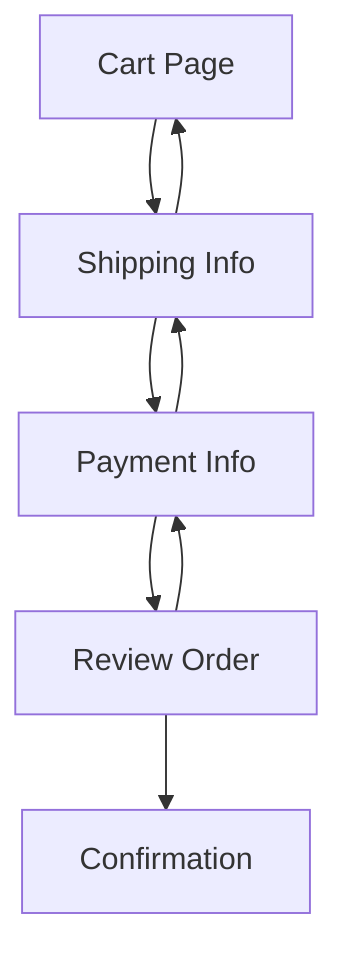

# Checkout

<!-- verify: ./spec.verify.ts -->

How an order becomes a payment. This document is the specification *and* the
test suite: every table and diagram below is executed against the real
implementation in [`checkout.ts`](./checkout.ts) on each run.

## Order totals

Tax applies to goods only — shipping is never taxed. Totals are rounded to
cents at the end, not per line.

> 🛠️ **Verified Data:** `orderTotals`
> **Schema:** `[itemsTotal: Currency, shipping: Currency, tax: Percentage, total: Currency]`

| Items Total | Shipping | Tax Rate | Total Owed |
| ----------- | -------- | -------- | ---------- |
| $10.00      | $5.00    | 10%      | $16.00     |
| $2.50       | $0.00    | 0%       | $2.50      |
| $100.00     | $0.00    | 25%      | $125.00    |
| $49.99      | $4.99    | 8.5%     | $59.23     |

## Navigation

A customer may move forward through checkout, and back one step at a time.
Skipping a step is never allowed — you cannot reach **Payment** without
supplying a shipping address first.

> 🛠️ **Verified Flow:** `checkoutFlow`

## Settlement

Which payment methods capture funds at the moment the order is placed, and
which merely authorise.

> 🛠️ **Verified Rules:** `settlementRules`

- [x] Card payments settle immediately
- [x] Wallet payments settle immediately
- [ ] Invoice payments settle immediately
- [ ] Transfer payments settle immediately

## Tax jurisdictions

The rates we charge, by jurisdiction. This table carries no `Schema:` line, so
handlers receive the cell text exactly as written.

> 🛠️ **Verified Table:** `taxJurisdictions`

| Code  | Jurisdiction   | Rate  |
| ----- | -------------- | ----- |
| DK    | Denmark        | 25%   |
| DE    | Germany        | 19%   |
| US-CA | California     | 7.25% |
| GB    | United Kingdom | 20%   |
